# Multi-Provider UI Integration Implementation Plan

## Current State Analysis

**✅ Infrastructure Complete:**
- Provider factory system
- Base streaming provider abstraction  
- Controller architecture within providers
- Type system and error handling
- Event bus and logging

**❌ Application Layer Issues:**
- All hooks use `useAgora()` directly
- Components import Agora SDK types directly
- Global `AgoraContext` provides Agora client
- No provider selection mechanism
- No unified streaming interface in UI

## Implementation Plan

### Step 1: Create Unified Streaming Context (3-4 days)

**Current:**
```typescript
// contexts/AgoraContext.tsx
export const AgoraProvider: React.FC = ({ children }) => {
  const client: RTCClient = useMemo(() => {
    return AgoraRTC.createClient({ mode: 'rtc', codec: 'vp8' }) as RTCClient;
  }, []);
  // ...
};
```

**Target:**
```typescript
// contexts/StreamingContext.tsx
export const StreamingProvider: React.FC = ({ children }) => {
  const [currentProvider, setCurrentProvider] = useState<StreamingProvider | null>(null);
  const [providerType, setProviderType] = useState<StreamProviderType>('agora');
  // ...
};
```

**Implementation:**
1. Create new `contexts/StreamingContext.tsx`
2. Integrate with `useStreamingProvider` hook
3. Add provider selection state management
4. Implement provider switching logic

### Step 2: Replace Agora-Specific Hooks (4-5 days)

**Current Issues:**
```typescript
// hooks/useStreaming.ts
import { IAgoraRTCRemoteUser, NetworkQuality } from 'agora-rtc-sdk-ng';
import { useAgora } from '../contexts/AgoraContext';

// hooks/useAudioControls.ts  
import AgoraRTC, { IMicrophoneAudioTrack } from 'agora-rtc-sdk-ng';
const { client } = useAgora();

// hooks/useVideoCamera.ts
import AgoraRTC, { ILocalVideoTrack } from 'agora-rtc-sdk-ng';
```

**Target Implementation:**
```typescript
// hooks/useUnifiedStreaming.ts
import { useStreamingProvider } from './useStreamingProvider';
import { VideoTrack, AudioTrack } from '../types/streaming.types';

export const useUnifiedStreaming = () => {
  const { provider, state, connect, disconnect } = useStreamingProvider();
  // Provider-agnostic implementation
};
```

**Hook Migration Priority:**
1. `useStreaming.ts` → `useUnifiedStreaming.ts`
2. `useAudioControls.ts` → Provider-agnostic version
3. `useVideoCamera.ts` → Provider-agnostic version
4. Create new unified hooks as needed

### Step 3: Update Components to Provider-Agnostic (3-4 days)

**Current Issues:**
```typescript
// components/VideoDisplay/index.tsx
import { ILocalVideoTrack } from 'agora-rtc-sdk-ng';
import { useAgora } from '../../contexts/AgoraContext';

// components/ChatInterface/index.tsx
import { useAgora } from '../../contexts/AgoraContext';

// components/NetworkQuality/index.tsx
import { NetworkQuality, RemoteVideoTrackStats } from 'agora-rtc-sdk-ng';
```

**Target:**
```typescript
// components/VideoDisplay/index.tsx
import { VideoTrack } from '../../types/streaming.types';
import { useStreamingContext } from '../../contexts/StreamingContext';
```

**Component Migration:**
1. Replace Agora SDK type imports with unified types
2. Replace `useAgora()` with `useStreamingContext()`
3. Update prop interfaces to use unified types
4. Test each component with provider abstraction

### Step 4: Create Provider Selection UI (2-3 days)

**New Component:**
```typescript
// components/ProviderSelector/index.tsx
export const ProviderSelector: React.FC = () => {
  const { providerType, switchProvider } = useStreamingContext();
  const supportedProviders = ['agora', 'livekit', 'trtc'];
  
  return (
    <div className="provider-selector">
      {supportedProviders.map(provider => (
        <button 
          key={provider}
          className={providerType === provider ? 'active' : ''}
          onClick={() => switchProvider(provider)}
        >
          {provider.toUpperCase()}
        </button>
      ))}
    </div>
  );
};
```

### Step 5: Update Main App Integration (2-3 days)

**Current App.tsx Issues:**
```typescript
// App.tsx - Lines 9, 15
import { useAgora } from './contexts/AgoraContext';
const { client } = useAgora();
```

**Target App.tsx:**
```typescript
// App.tsx
import { useUnifiedStreaming } from './hooks/useUnifiedStreaming';
import { useStreamingContext } from './contexts/StreamingContext';
import { ProviderSelector } from './components/ProviderSelector';

const App: React.FC = () => {
  const { state, startStreaming, stopStreaming } = useUnifiedStreaming();
  const { providerType } = useStreamingContext();
  
  return (
    <div>
      <ProviderSelector />
      {/* Rest of the app using unified interfaces */}
    </div>
  );
};
```

### Step 6: Remove Agora-Specific Dependencies (1-2 days)

**Files to Refactor/Remove:**
1. `contexts/AgoraContext.tsx` → Remove or keep as legacy
2. `agoraHelper.ts` → Extract provider-agnostic utilities
3. Update `main.tsx` to use `StreamingProvider`
4. Remove direct Agora imports from non-provider files

**Global Cleanup:**
```typescript
// main.tsx - Current
import { AgoraProvider } from './contexts/AgoraContext';

// main.tsx - Target
import { StreamingProvider } from './contexts/StreamingContext';
```

## Implementation Timeline

```mermaid
gantt
    title Multi-Provider UI Integration
    dateFormat X
    axisFormat %d days
    
    section Step 1: Context
    Create StreamingContext   :s1, 0, 4d
    
    section Step 2: Hooks  
    Migrate useStreaming     :s2, after s1, 2d
    Migrate useAudioControls :after s2, 2d
    Migrate useVideoCamera   :after s2, 2d
    
    section Step 3: Components
    Update VideoDisplay      :s3, after s2, 2d
    Update ChatInterface     :after s3, 1d
    Update NetworkQuality    :after s3, 1d
    
    section Step 4: Provider UI
    Create ProviderSelector  :s4, after s3, 3d
    
    section Step 5: App Integration
    Update App.tsx          :s5, after s4, 2d
    Update main.tsx         :after s5, 1d
    
    section Step 6: Cleanup
    Remove Agora deps       :s6, after s5, 2d
```



## Success Criteria

**Phase 3B Complete:**
- ✅ Zero direct Agora SDK imports outside providers/
- ✅ All hooks use provider-agnostic interfaces
- ✅ Components work with any provider type
- ✅ No `useAgora()` calls in application code

**Phase 4B Complete:**
- ✅ Provider selection UI functional
- ✅ Runtime provider switching works
- ✅ Unified streaming interface fully integrated
- ✅ App runs with any of the three providers

## Risk Mitigation

1. **Backward Compatibility**: Keep Agora as default provider during migration
2. **Incremental Testing**: Test each component as it's migrated
3. **Feature Parity**: Ensure no functionality is lost during migration
4. **Type Safety**: Maintain strict TypeScript throughout migration

## Next Steps

1. **Get user approval** for this implementation plan
2. **Start with Step 1** - Create StreamingContext
3. **Implement incrementally** with testing at each step
4. **Maintain working Agora functionality** throughout migration
